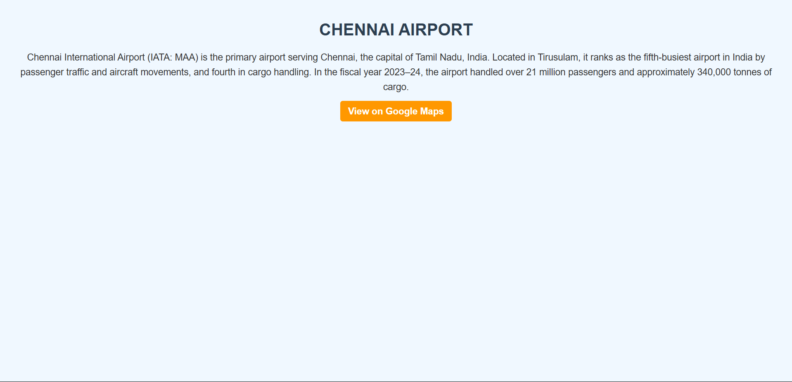

# Ex04 Places Around Me
# Date: 28.04.2025
# AIM
To develop a website to display details about the places around my house.

# DESIGN STEPS
## STEP 1
Create a Django admin interface.

## STEP 2
Download your city map from Google.

## STEP 3
Using <map> tag name the map.

## STEP 4
Create clickable regions in the image using <area> tag.

## STEP 5
Write HTML programs for all the regions identified.

## STEP 6
Execute the programs and publish them.

# CODE
### map.html
```
<html>
    <head>
        <title>
            Map
        </title>
        <style>
            center img {
                max-width: 90%;
                height: 80%;
            }
        </style>
    </head>
    <body>
        <h1 align="center">
            CHENNAI
        </h1>
        <h3 align="center">
            BAUDHIGAN (212223230028)
        </h3>
    </body>
        <center>
            

            <map name="image-map">
                <area target="_blank" alt="N4 Beach" title="N4 BEACH" href="beach.html" coords="800,170,30" shape="circle">
                <area target="_blank" alt="Saveetha Engineering College" title="SAVEETHA ENGINEERING COLLEGE" href="college.html" coords="155,400,30" shape="circle">
                <area target="_blank" alt="Chennai Rail Museum" title="CHENNAI RAIL MUSEUM" href="museum.html" coords="575,245,30" shape="circle">
                <area target="_blank" alt="Kapaleeshwarar Temple" title="KAPALEESHWARAR TEMPLE" href="temple.html" coords="750,380,30" shape="circle">
                <area target="_blank" alt="Chennai Airport" title="CHENNAI AIRPORT" href="airport.html" coords="500,480,30" shape="circle">
            </map>


</html>

```

### airport.html
```
<!DOCTYPE html>
<html lang="en">
<head>
    <meta charset="UTF-8">
    <meta name="viewport" content="width=device-width, initial-scale=1.0">
    <title>Chennai Airport</title>
    <style>
        body {
            background-color: #f0f8ff;
            font-family: Arial, sans-serif;
            margin: 40px;
            color: #333;
        }
        h1 {
            color: #2c3e50;
            text-align: center;
        }
        p {
            font-size: 18px;
            line-height: 1.6;
            text-align: center;
        }
        a {
            color: #ffffff;
            background-color: #ff9800;
            padding: 10px 15px;
            text-decoration: none;
            border-radius: 5px;
            font-weight: bold;
            
        }
        a:hover {
            background-color: #005b99;
            text-align: center;
        }
    </style>
</head>
<body>
    <h1>CHENNAI AIRPORT</h1>

    <p>Chennai International Airport (IATA: MAA) is the primary airport serving Chennai, the capital of Tamil Nadu, India. Located in Tirusulam, it ranks as the fifth-busiest airport in India by passenger traffic and aircraft movements, and fourth in cargo handling. In the fiscal year 2023–24, the airport handled over 21 million passengers and approximately 340,000 tonnes of cargo. </p>
    <p><a href="https://maps.app.goo.gl/i5KaszNPcMHFs7aL6" target="_blank">View on Google Maps</a></p>
</body>
</html>
```

### beach.html
```
<!DOCTYPE html>
<html lang="en">
<head>
    <meta charset="UTF-8">
    <meta name="viewport" content="width=device-width, initial-scale=1.0">
    <title>N4 Beach</title>
    <style>
        body {
            font-family: Arial, sans-serif;
            background-color: #fff8e1;
            color: #333;
            margin: 0;
            padding: 0;
        }
        h1 {
            text-align: center;
            color: #ff9800;
            background-color: #fff;
            padding: 20px;
            margin-bottom: 0;
            border-bottom: 2px solid #ff9800;
        }
        p {
            font-size: 18px;
            line-height: 1.6;
            color: #444;
            padding: 15px 20px;
            text-align: center;
        }
        a {
            color: #fff;
            background-color: #ff9800;
            padding: 10px 15px;
            text-decoration: none;
            border-radius: 5px;
            font-weight: bold;
        }
        a:hover {
            background-color: #f57c00;
        }
    </style>
</head>
<body>
    <h1>N4 BEACH</h1>
    <p>N4 Beach, located in the Kasimedu area of North Chennai, is a serene coastal spot known for its tranquil atmosphere and picturesque views. Unlike the bustling Marina Beach, N4 offers a quieter experience, making it ideal for peaceful walks and sunset photography. The beach is adjacent to a fishing harbor, allowing visitors to observe local fishermen at work, especially during early mornings. While it's appreciated for its calmness, visitors should be aware of occasional cleanliness issues due to littering. Accessible via public transport, the nearest metro station is Kaladipet, about a 12-minute walk away.</p>
    <p><a href="https://maps.app.goo.gl/uAwLkWaugrWv8a3PA" target="_blank">View on Google Maps</a></p>
</body>
```

### college.html
```
<!DOCTYPE html>
<html lang="en">
<head>
    <meta charset="UTF-8">
    <meta name="viewport" content="width=device-width, initial-scale=1.0">
    <title>Saveetha Engineering College</title>
    <style>
        body {
            font-family: Arial, sans-serif;
            background-color: #f4f4f4;
            color: #333;
            margin: 0;
            padding: 0;
        }
        h1 {
            text-align: center;
            color: #8a2be2;
            background-color: #fff;
            padding: 20px;
            margin-bottom: 0;
            border-bottom: 2px solid #8a2be2;
        }
        p {
            font-size: 18px;
            line-height: 1.6;
            color: #444;
            padding: 15px 20px;
            text-align: center;
        }
        a {
            color: #fff;
            background-color: #8a2be2;
            padding: 10px 15px;
            text-decoration: none;
            border-radius: 5px;
            font-weight: bold;
        }
        a:hover {
            background-color: #6a1d9d;
        }
    </style>
</head>
<body>
    <h1>SAVEETHA ENGINEERING COLLEGE</h1>
    <p>​Saveetha Engineering College (SEC), established in 2001, is an autonomous institution located in Thandalam, Chennai, Tamil Nadu. Affiliated with Anna University and approved by the All India Council for Technical Education (AICTE), SEC offers a range of undergraduate and postgraduate programs in engineering and management.</p>
    <p>The college provides 12 undergraduate courses, including disciplines such as Artificial Intelligence & Data Science, Biomedical Engineering, Civil Engineering, Computer Science Engineering, and Mechanical Engineering. Postgraduate offerings include MBA and M.E. programs. SEC has received accreditation from the National Board of Accreditation (NBA) and the National Assessment and Accreditation Council (NAAC), reflecting its commitment to quality education.</p>
    <p>Spanning a 120-acre campus, SEC is equipped with modern facilities, including well-furnished classrooms, laboratories, a library, hostels, sports complexes, and a gymnasium. The institution emphasizes practical learning through compulsory internships and industry collaborations.</p>
    <p><a href="https://maps.app.goo.gl/3rM9VPwmEmqdbAd97" target="_blank">View on Google Maps</a></p>
</body>
</html>
```

### museum.html
```
<!DOCTYPE html>
<html lang="en">
<head>
    <meta charset="UTF-8">
    <meta name="viewport" content="width=device-width, initial-scale=1.0">
    <title>Chennai Rail Museum</title>
    <style>
        body {
            font-family: Arial, sans-serif;
            background-color: #fff8e1;
            color: #333;
            margin: 0;
            padding: 0;
        }
        h1 {
            text-align: center;
            color: #ff9800;
            background-color: #fff;
            padding: 20px;
            margin-bottom: 0;
            border-bottom: 2px solid #ff9800;
        }
        p {
            font-size: 18px;
            line-height: 1.6;
            color: #444;
            padding: 15px 20px;
            text-align: center;
        }
        a {
            color: #fff;
            background-color: #ff9800;
            padding: 10px 15px;
            text-decoration: none;
            border-radius: 5px;
            font-weight: bold;
        }
        a:hover {
            background-color: #f57c00;
        }
    </style>
</head>
<body>
    <h1>CHENNAI RAIL MUSEUM</h1>
    <p>The Chennai Rail Museum, situated in Perambur, Chennai, is a captivating destination that celebrates India's rich railway heritage. Established in 2002 within the premises of the Integral Coach Factory (ICF), the museum spans 6.25 acres and offers both indoor and outdoor exhibits .</p>
    <p>Visitors can explore a diverse collection of vintage locomotives and coaches, including steam engines from the British colonial era and the luxurious Prince of Wales Saloon. The museum also features the Nilgiri Mountain Railway coach, providing insights into the engineering marvels of the past .</p>
    <p>Beyond the exhibits, the museum offers interactive experiences such as a toy train ride that circles the premises, a Dolby Digital movie theatre showcasing railway heritage films, and an art gallery displaying railway-themed artworks . These attractions make it an educational and enjoyable outing for families, students, and railway enthusiasts alike.​</p>
    <p><a href="https://maps.app.goo.gl/qkxoVh5uZQdPjmkM6" target="_blank">View on Google Maps</a></p>
</body>
</html>
```

### temple.html
```
<!DOCTYPE html>
<html lang="en">
<head>
    <meta charset="UTF-8">
    <meta name="viewport" content="width=device-width, initial-scale=1.0">
    <title>Kapaleeshwarar Temple</title>
    <style>
        body {
            font-family: Arial, sans-serif;
            background-color: #f0f8ff;
            color: #333;
            margin: 0;
            padding: 0;
        }
        h1 {
            text-align: center;
            color: #ff6347;
            background-color: #fff;
            padding: 20px;
            margin-bottom: 0;
            border-bottom: 2px solid #ff6347;
        }
        p {
            font-size: 18px;
            line-height: 1.6;
            color: #444;
            padding: 15px 20px;
            text-align: center;
        }
        a {
            color: #fff;
            background-color: #ff6347;
            padding: 10px 15px;
            text-decoration: none;
            border-radius: 5px;
            font-weight: bold;
        }
        a:hover {
            background-color: #e53e3e;
        }
    </style>
</head>
<body>
    <h1>KAPALEESHWARAR TEMPLE</h1>
    <p>Kapaleeshwarar Temple, located in Mylapore, Chennai, is a revered Hindu temple dedicated to Lord Shiva, worshipped here as Kapaleeshwarar, and his consort Parvati, known as Karpagambal. Believed to have been originally constructed in the 7th century CE by the Pallavas, the temple showcases classic Dravidian architecture, featuring a towering 37-meter-high gopuram adorned with intricate sculptures .​</p>
    <p>According to legend, Parvati worshipped Shiva in the form of a peahen at this site, which led to the area's name, Mylapore—derived from 'Mayil,' meaning peacock in Tamil . The temple complex includes a sacred tank, shrines for various deities, and bronze statues of the 63 Saivite saints, known as Nayanars .​</p>
    <p>Kapaleeshwarar Temple is not only a significant religious site but also a cultural landmark, attracting devotees and tourists alike. It is renowned for its vibrant festivals, especially the Panguni Peruvizha, celebrated in March-April, which features a grand procession of deities through the streets of Mylapore .​</p>
    <p><a href="https://maps.app.goo.gl/BjXvkhXn9B8qfTSdA" target="_blank">View on Google Maps</a></p>
</body>
</html>
```
# OUTPUT




# RESULT
The program for implementing image maps using HTML is executed successfully.
